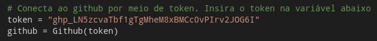
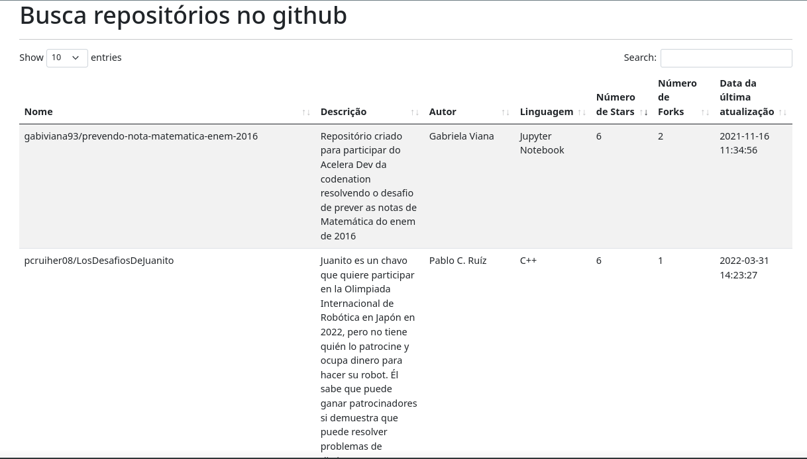

# Desafio Estagio - 2022.1 - McFile

## Instruções para inserir token de acesso na aplicação

Gere um token de acesso pessoal ao github com as instruções neste link:

[Creating a personal access token - GitHub Docs](https://docs.github.com/en/enterprise-server@3.4/authentication/keeping-your-account-and-data-secure/creating-a-personal-access-token)

Ele será importante para conexão com a API do Github.

Nos arquivos busca_repo.py e/ou [desafio.py](http://desafio.py), insira ou substitua o token criado na variável token, assim como na imagem abaixo:



## Instruções de instalação de dependências e execução do desafio

Para executar o projeto primeiro instale as dependências com:

```bash
pip3 install -r requirements.txt
```

Em seguida, execute o arquivo busca_repos.py em algum terminal ou prompt de comando com:

```bash
python3 busca_repos.py
```

Acesse o endereço [http://localhost:5000](http://localhost:5000). Volte ao terminal e informe o termo para busca, espere a aplicação terminar de armazenar os resultados no banco de dados temporário/local e acesse o endereço no navegador para ver uma tabela com as informações solicitadas sobre o repositório encontrado.



**Nota:** o arquivo desafio.py faz a busca no Github e exibe os resultados por meio do terminal mesmo. Ele pode ser executado de forma normal com python e para funcionar, basta informar o termo de busca.